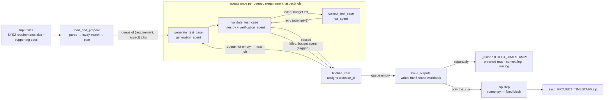

# sys5 — Handoff Guide

This is the walkthrough to read before touching `backend/app/core/artifacts/sys5/`. It
follows one config dict from `run()` all the way to the finished SYS5 workbook,
stage by stage — what runs, why it's built that way, and where to look when something
needs changing.

## 1. Start here

**sys5** turns a SYS2 (System Requirements) workbook plus a project's supporting docs —
signal lists, command lists, communication matrices, configurable parameters, test
patterns — into a formatted SYS5 (System Qualification Test Cases) Excel workbook. One
requirement can become several test cases; each test case is planned, drafted, checked,
and — if it fails — corrected, all through an LLM working under a fairly tight leash of
deterministic rules.

The entry point is one function:

```python
def generate(config: dict) -> str:  # runner.py
    # ... returns the path to a .zip containing the finished workbook
```

> **Don't touch.** `runner.py` has two blocks fenced with `#####Donot change this part in
> code`. The first unpacks the caller's config dict (project name, username, model,
> folders, `agent_chain`...); the second zips every non-`.zip` file sitting in
> `output_dir` once the run finishes. That's the fixed contract with whatever calls
> `run()` — everything we own sits between those two blocks, in
> `Sys5Config.from_raw()` and `run_pipeline()`.

Because of that second block, there's one rule that shapes a lot of downstream design:
**`output_dir` may only ever contain the final `.xlsx`**. Every intermediate file —
enriched requirements, per-requirement logs, run summaries — gets written somewhere else
entirely (`_runs/`, covered in [§7](#7-logs--run-artifacts)).

## 2. The big picture

Internally, `run_pipeline()` (`pipeline.py`) builds the LLM client once, compiles a
six-node [LangGraph](https://github.com/langchain-ai/langgraph) state machine
(`graph/build.py`), and runs it. One node, `load_and_prepare`, runs once. The middle
three nodes — `generate_test_case`, `validate_test_case`, `correct_test_case` — run in a
bounded loop, once per planned test case, until the whole queue is drained.



One requirement can spawn several queued jobs (one per planned test aspect). Each job
cycles the middle loop independently; `correct_test_case` is only visited when a job
fails and still has correction budget left (`max_correction_attempts`,
`max_validation_attempts`) — otherwise it's finalized straight away, flagged via
`remarks`.

## 3. Config & credentials

`Sys5Config.from_raw()` (`config.py`) turns the caller's raw dict into a typed, defaulted
config — every sys5-specific knob has a sane default, so the example config in the
project brief works unmodified. A project only overrides what it actually cares about.

| Field | Default | What it actually controls |
|---|---|---|
| `domain` | `""` | Picks an automotive-domain prompt add-on — see [§6](#6-domain-aware-prompts). |
| `model` | `""` | Model name passed straight to `ChatOpenAI`. |
| `agent_chain` | `[]` | Per-agent prompt overrides from the caller — see [§4](#4-stage-by-stage) and `prompts/registry.py`. |
| `req_filename` / `req_sheet_name` | `""` / `""` | Which workbook/sheet holds the requirements. Blank sheet name = scan every sheet. |
| `sys5_keywords` | `["sys5 test", "sys qt", ...]` | What marks a row as a requirement to test — see [§4.1](#41-load_and_prepare). |
| `keyword_match_threshold` | `85` | Fuzzy-match floor for keyword detection (rapidfuzz `partial_ratio`). |
| `fuzzy_match_threshold` | `60` | Tier-1 row-level supporting-context match floor. |
| `token_match_threshold` | `85` | Tier-2 token-level supporting-context match floor. |
| `max_supporting_context_items` | `25` | Cap on attached context rows per requirement. |
| `max_validation_attempts` / `max_correction_attempts` | `2` / `1` | The generate→validate→correct budget per test case. |
| `test_case_id_pattern` | `{project_code}_SQMTC_{n:03d}` | How `testcase_id` is formatted in `finalize_item`. |
| `structured_output_method` | `json_schema` | Passed to `with_structured_output()` — flip to `function_calling` for gateways that don't support the schema mode. |
| `format_profile` | `"default"` | Which workbook layout to render — see [§5](#5-reaching-the-output-workbook). |

### Credentials

The LLM client (`llm/client.py::build_chat_model`) reads two environment variables,
validated immediately — before any Excel parsing runs, so a bad key fails loudly and
fast:

- `OPENAI_API_KEY` — required, no working default. Raises `LlmClientError` if unset.
- `SYS5_LLM_API_BASE` — optional, falls back to the on-prem gateway hardcoded as
  `DEFAULT_API_BASE`.

Copy `sys5/.env.example` to `sys5/.env` and fill in real values; it loads automatically
via `python-dotenv` without overriding a value already set in the real environment.

## 4. Stage by stage

Each node in `graph/nodes.py` is a pure function: `(PipelineState) -> dict`, returning
only the slice of state it owns. Below, for each one: what it does, why it's built that
way, and the thing most likely to bite you if you change it.

### 4.1 `load_and_prepare`

*Runs once.* Three things happen here, in order:

- **Load reqs** — `excel/requirements_loader.py` scans every cell of every row of the
  target sheet for a `sys5_keywords` hit (plain substring first, rapidfuzz fallback).
  Any hit makes that row a candidate requirement — the header row itself is found
  afterward by scanning upward from the first hit, since these sheets don't reliably
  have a header on row 1.
- **Load context** — `excel/supporting_docs_loader.py` indexes every non-empty row of
  every supporting-doc sheet (signals, commands, comm matrix, parameters, patterns —
  shape varies per project, so nothing is hardcoded except "index every row").
- **Per requirement** — `enrich_requirement()` fuzzy-attaches relevant context rows (see
  below), then `_plan_aspects()` calls **planning_agent** to turn the requirement into
  one or more test *aspects* — short scenario descriptions, one per case that needs
  separate verification. Each aspect becomes one queued job.

> **Why fuzzy matching, two tiers.** `matching/fuzzy_context.py` runs **tier 1** (the
> whole requirement sentence vs. each supporting row's full text, `token_set_ratio` —
> good for long-sentence-vs-short-row comparisons) and **tier 2** (each row's individual
> short field values vs. the requirement text, `partial_ratio`, tighter threshold —
> catches one specific signal name tier 1 missed). Scores merge (max wins), rank, and
> cap at `max_supporting_context_items`. Every field value across attached rows also
> becomes `allowed_signal_tokens` — the whitelist `validation/rules.py` checks generated
> steps against, so the LLM can't invent a signal name that isn't in the project's own
> docs.

> **Fixed bug — worth knowing about.** `req_id` (the traceability ID used everywhere
> downstream) is read from **the row's first column only**. It used to scan every column
> header for an "id"-ish hint (`"requirement id"`, `"req id"`, plain `"id"`), but a bare
> substring match on `"id"` also matches unrelated headers — `"Valid"`, `"Provided"`,
> `"Guidance"` all contain it — so an earlier false-hit column could silently steal the
> ID slot. If you're debugging odd traceability, this is the first place to check: is
> the real ID actually in column A of the source sheet?

### 4.2 `generate_test_case`

*Per queued job.* Calls **generation_agent** with the requirement, the planned aspect,
any other authored columns on the requirement row (a Precondition/Test Procedure block,
if present, is treated as near-authoritative), and the attached supporting context. Asks
for a `GeneratedTestCase` via structured output — never free text.

> **Why structured output, not prose.** The LLM emits typed fields —
> `setup_action_steps`, `verification_steps`, each a `SET`/`WAIT`/`VERIFY` step object
> with a `detail` and optional `expected_result` — never the final numbered `"1.
> Test_start..."` strings. Numbering those directly would ask the model to count
> sequentially and keep two columns in lockstep; LLMs are unreliable at exactly that.
> Instead `validation/numbering.py::render()` is the one place that turns steps into
> numbered text, called by both the validator and the workbook writer — so the two
> output columns can never desync.

If the call throws, the job doesn't crash the run: a stub `GeneratedTestCase` is
produced (objective prefixed `[GENERATION FAILED]`), and both attempt budgets are
pre-maxed so the next `validate_test_case` routes straight to `finalize_item` instead of
spending more LLM calls on something already doomed.

### 4.3 `validate_test_case`

*Per queued job, per attempt.* Two passes, and the second only runs if the first is
clean:

- **Deterministic** — `validation/rules.py::check_test_case()` — no LLM call. Fails if
  there are no steps at all, if no verification step has a checkable `expected_result`,
  or (as a *warning*, not a hard fail) if a step references an identifier-like token not
  in `allowed_signal_tokens`.
- **Semantic** — only runs if the deterministic pass is clean. Calls
  **verification_agent** with the requirement, aspect, and generated case, asking
  whether it actually proves the requirement's real intent — not just something
  superficially related — and for concrete feedback if not.

> **Honesty note, carried from the code's own comments.** The token-whitelist check is
> defense-in-depth, not a mathematical guarantee against hallucination — string matching
> has real false positives (a legit token phrased slightly differently) and false
> negatives (a hallucinated token that happens to look like a real one). Treat
> `unrecognized_token` warnings as a strong hint, not proof either way.

### 4.4 `correct_test_case`

*Only on failure, if budget remains.* Calls **qa_agent** with the original
requirement/aspect, the failed test case, and the specific validation issues/semantic
feedback, asking for a corrected version that fixes every listed issue without breaking
what was already right. Same hard rules as generation apply (verb restrictions,
no-hallucination, at least one checkable verification step). Loops back into
`validate_test_case` — `correction_attempts` and `validation_attempts` are the two
independent budgets that eventually force an exit (see [the diagram](#2-the-big-picture)).

### 4.5 `finalize_item`

*Per queued job, once.* The one place a `testcase_id` gets assigned — formatted from
`test_case_id_pattern` (default `{project_code}_SQMTC_{n:03d}`), a running counter,
never invented by the LLM. Wraps the draft into a full `TestCase`, records pass/fail +
attempt count to `remarks` if it failed, appends to `results`, and shrinks the queue by
one — which is what actually drives the loop forward.

### 4.6 `build_outputs`

*Runs once, queue empty.* Writes the final workbook ([§5](#5-reaching-the-output-workbook))
into `output_dir`, and separately writes every intermediate artifact into this package's
own `_runs/` directory ([§7](#7-logs--run-artifacts)) — kept apart on purpose, since
`runner.py`'s fixed zip step packages *everything* it finds in `output_dir`.

## 5. Reaching the output workbook

`output/workbook_builder.py::build_workbook()` assembles exactly five sheets, using
whichever `format_profile` the config names (only `"default"` exists today —
`formats/default_profile.py`).

| Sheet | Where it comes from |
|---|---|
| **Test Cases** | Mechanically rendered from `state["results"]` — every finalized `TestCase`, one row each. Columns: ID, feature, variant, traceability (`requirement_ids`), objective, description, pre-condition, input data, numbered Test Steps / Expected Results, mode of execution, priority, ODC trigger. |
| **Cover Page** | Templated from config + the first requirement's feature metadata (title, doc number, version, revision row). |
| **Test Pattern** | Sourced from a supporting-doc sheet fuzzy-matched by name ("test pattern", "combinatorial"...); a labeled placeholder if none is found. Never fabricated. |
| **Item List** | A 1:1 index of every generated test case (Sr#, type, feature, ID, variants, remarks) — always derived from `results`, reflects exactly what was actually generated. |
| **Configurable Parameters** | Same sourcing rule as Test Pattern, matched against a different set of sheet-name hints. |

The `Test Steps` / `Expected Results` columns are always rendered by
`validation/numbering.py::render()` — numbering starts at `1. Test_start`, walks every
setup/action step then every verification step in order, and ends at `<n>. End_of_test`.
`Expected Results` only gets an entry for steps with a checkable outcome, but its
numbers still line up with the matching `Test Steps` line.

Traceability back to the source requirement is just `GeneratedTestCase.requirement_ids`
— which is why the [req_id fix](#41-load_and_prepare) in `load_and_prepare` matters:
everything downstream, including this column, is only as correct as that one
first-column read.

## 6. Domain-aware prompts

`Sys5Config.domain` — set via the `domain` key in the config dict passed to
`run()` — can name one of six automotive domains: `bcm`, `adas`, `telematics`,
`range_polygon`, `chassis`, `powertrain`.

Each maps to a contextual-grounding block in `prompts/domains.py` — what that kind of
system typically does, what its tests typically hinge on (the relevant precondition, the
specific trigger, what a checkable outcome looks like). **Deliberately no signal/command
names** — those still only ever come from the project's own supporting docs, matching
the no-hallucination rule elsewhere in the pipeline. Free-text aliases are handled
(`"Body Control Module"`, `"Range Polygon"`, `"power train"`, etc. all resolve); an
unrecognized or blank domain is a silent no-op.

It's injected at a single choke point — `prompts/registry.py::resolve_system_prompt()` — which
every one of the four agent calls already goes through:

```python
def resolve_system_prompt(agent_chain, agent_name, domain="") -> str:
    base          # = agent_chain override, or our DEFAULT_PROMPTS default
    domain_addon  # = resolve_domain_prompt(domain), or None
    return f"{base}\n\n{domain_addon}" if domain_addon else base
```

That means it applies uniformly to **planning, generation, verification, and qa** —
whether the base prompt is our built-in default or a project's `agent_chain` override —
without touching any individual agent's prompt file.

## 7. Logs & run artifacts

Every module logs via `logging.getLogger(__name__)` — sys5 never configures logging
itself, a host app's own config decides where it ends up. At INFO level, expect to see:
which sheet(s)/files got scanned and how many rows matched, which requirement is being
processed and exactly what got fuzzy-attached to it, every agent call (which agent,
which requirement/aspect) and its pass/fail outcome, and retries on transient LLM
errors.

```text
12:01:46 INFO  requirements_loader: [sys5] Sheet 'Reqs': 1 row(s) matched a sys5 keyword; header row=2.
12:01:46 INFO  requirements_loader: [sys5] Sheet 'Reqs' row 3: req_id='1' (matched keyword 'sys5 test')
12:01:46 INFO  graph.nodes: [sys5] Requirement 1: attached 1 supporting-context item(s): ['other:Reqs#3(score=100)']
12:01:46 INFO  graph.nodes: [sys5] Calling generation_agent for requirement 1, aspect 'A1' (Nominal activation)
12:01:46 INFO  graph.nodes: [sys5] Validation result for requirement 1, aspect 'A1' (attempt 1): PASSED
12:01:46 INFO  graph.nodes: [sys5] Finalized requirement 1, aspect 'A1' -> DRY_RUN_SQMTC_001 (passed=True, attempts=1)
```

For a persistent, reviewable record — not just what scrolled past in the console —
`build_outputs` writes four files per run to `_runs/<project>_<timestamp>/`:

| File | What's in it |
|---|---|
| `enriched_requirements.json` | Every processed requirement plus its attached supporting-doc context — machine-readable, keyed by `req_id`. |
| `requirements_context.log` | The human-readable version — one block per requirement, its text, and exactly which supporting-doc rows were attached and why (match score). This is the file to open when you want to sanity-check "did the right context reach this requirement?" without wading through JSON. |
| `run_log.jsonl` | One line per event — planning failures, per-test-case outcomes, the final `build_outputs` entry with the xlsx path. |
| `run_summary.json` | Final totals: test case count, requirement count, collected errors. |

Sample `requirements_context.log` block:

```text
=== 1 ===
Source: 'Reqs' row 3 (requirements.xlsx, matched keyword 'sys5 test')
Requirement text: When the switch is pressed, the system shall turn on the light.
Supporting context (1 item(s), highest match first):
  [other | Reqs#3 | score=100] ID=1, Requirement Text=..., Verification Method=sys5 test
```

## 8. Running it without an LLM

`tests/test_sys5_fixed_blocks.py` exercises `runner.run()` end to end - Excel
loading, keyword scan, fuzzy matching, the full graph, workbook + intermediate writing,
the zip step — against a small synthetic requirements file, with `build_chat_model` and
`call_structured` both patched to deterministic stubs. No `OPENAI_API_KEY`, no network
access, no real project input.

It's a wiring check, not a quality check: use it after touching config parsing, the
graph, the loaders, or the workbook writer, to confirm nothing throws before you spend a
real LLM call on it.

## 9. Known rough edges

Said out loud on purpose, in the code's own comments — worth repeating here:

- The "no hallucinated signal" guarantee (token whitelist + prompt instruction + an LLM
  semantic check) is **defense-in-depth, not a mathematical proof** — string matching
  has irreducible false positive/negative edges (abbreviations, unit suffixes).
- Only the `"default"` format profile exists. A project needing different output
  columns/headings is a new `formats/<name>_profile.py` plus one line in
  `formats/registry.py` — nothing else changes.
- `llm/client.py`'s env var names (`OPENAI_API_KEY`, `SYS5_LLM_API_BASE`) are
  placeholders for the on-prem gateway — rename in that one file if the real deployment
  differs.
- The recursion limit in `pipeline.py` assumes up to ~600 requirement rows per the
  input-file spec; a genuinely larger batch would need that budget revisited.

## 10. Quick reference

### File map

| Concern | Module |
|---|---|
| Config parsing/defaults | `config.py` |
| Data models | `models/` |
| Reading the requirements sheet | `excel/requirements_loader.py` |
| Reading supporting docs | `excel/supporting_docs_loader.py` |
| Attaching context to a requirement | `matching/fuzzy_context.py` |
| Agent prompts | `prompts/` |
| Automotive-domain prompt add-ons | `prompts/domains.py` |
| LLM client + retry | `llm/client.py` |
| The graph itself | `graph/` |
| Deterministic test-case checks | `validation/rules.py` |
| Test Steps / Expected Results rendering | `validation/numbering.py` |
| Output workbook shape | `formats/` |
| Writing the .xlsx | `output/` |
| Where intermediate files go | `paths.py` |
| Standalone logging setup | `logging_config.py` |

### Glossary

- **SYS2** — The input: a System Requirements workbook.
- **SYS5** — The output: System Qualification Test Cases — what this whole pipeline
  exists to produce.
- **aspect** — One planned test scenario for a requirement, from planning_agent. A
  requirement can yield several.
- **enriched requirement** — A `Requirement` plus its attached `supporting_context` and
  `allowed_signal_tokens` — everything the generation agent is allowed to reference.
- **supporting entity** — One indexed row from a supporting-doc sheet, pre-processed for
  fuzzy search (`excel/supporting_docs_loader.py`).
- **allowed_signal_tokens** — The whitelist of field values from attached context — what
  the deterministic validator checks generated steps against.
- **agent_chain** — A project's list of per-agent prompt overrides, passed in the config
  dict.
- **req_id** — Traceability ID for a requirement — read from the row's first column only
  (see [§4.1](#41-load_and_prepare)).
- **testcase_id** — Assigned once, in finalize_item, from `test_case_id_pattern` — never
  invented by the LLM.
- **format_profile** — Which workbook layout definition to render — only `"default"`
  exists today.

---

Questions this doc doesn't answer are probably answered by the module's own docstring —
every file in `sys5/` opens with one explaining what it's for and why it's shaped that
way. Start there next.
